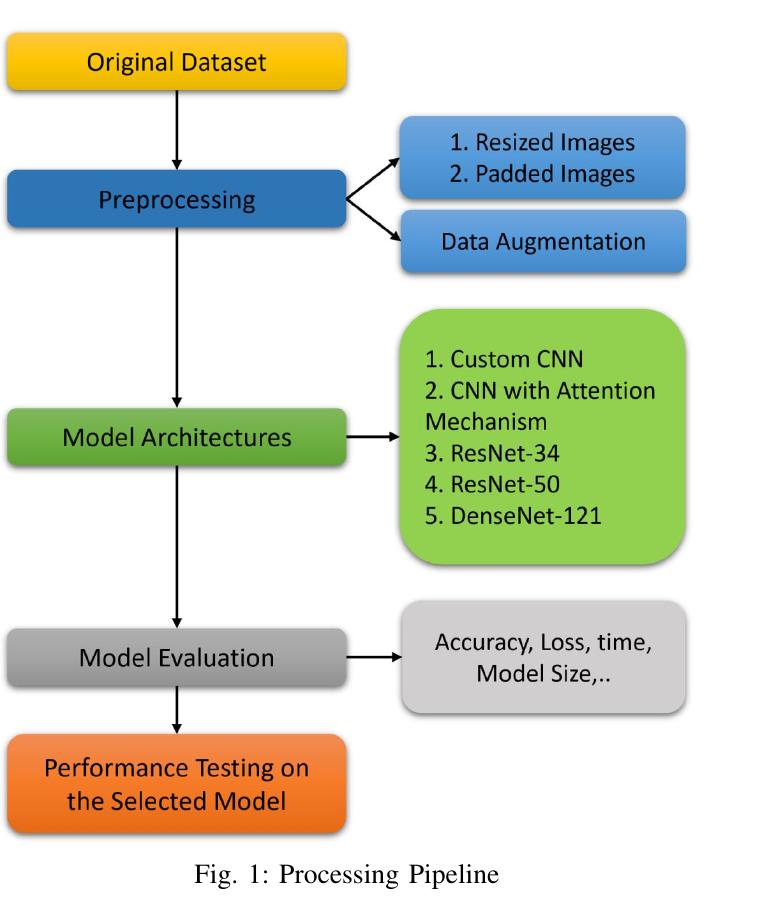
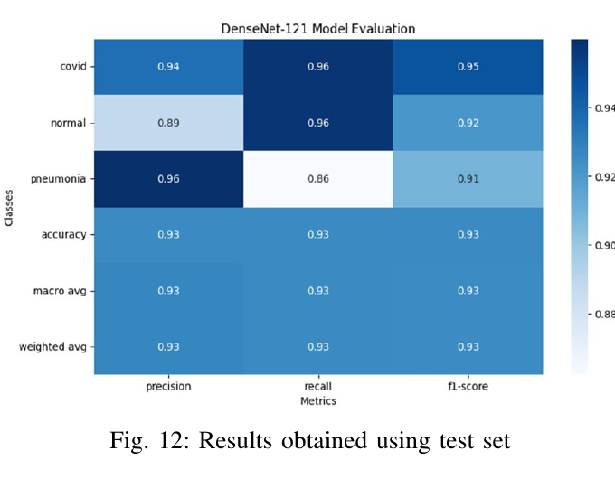
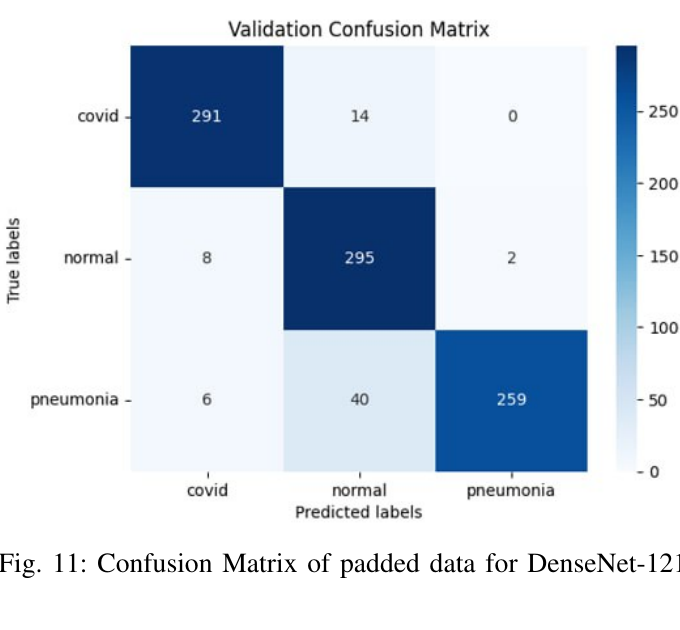

# Deep Learning for Medical Image Classification

> Benchmarking five CNN architectures for **three-class chest X-ray classification** — COVID-19, non-COVID pneumonia, and normal cases — with a focus on the trade-off between diagnostic accuracy and computational efficiency for resource-constrained clinical settings.

**Authors:** Berker Senol, Roya Ghamari
**Institution:** University of Padova — Human Data Analytics
**Paper:** [`Senol_Ghamari.pdf`](./paper/Senol_Ghamari.pdf)

---

## TL;DR — Key Result

| Model | Params | Val. Accuracy | Training Time | Model Size |
|---|---|---|---|---|
| Custom CNN | 11.0 M | 89.8% | 426 s | 42 MB |
| **CNN + SE Attention** | **2.6 M** | **91.8%** | **913 s** | **10 MB** |
| ResNet-34 | 21.3 M | 90.6% | 1,137 s | 81 MB |
| ResNet-50 | 23.6 M | 89.1% | 1,483 s | 90 MB |
| **DenseNet-121** ⭐ | **37.4 M** | **92.3%** | **4,305 s** | **143 MB** |

**DenseNet-121** (padded inputs) was selected as the best model with **93% test accuracy** across all three classes.
Notably, the **custom CNN with a Squeeze-and-Excitation attention block** reached **91.8% validation accuracy** with **~14× fewer parameters** and **~14× smaller model size** than DenseNet-121 — a compelling option when compute is constrained.

---

## Motivation

Distinguishing between viral pneumonia (including COVID-19), bacterial/non-COVID pneumonia, and healthy lungs from chest radiographs is a clinically important but challenging task — the visual signatures of these conditions can be subtle and overlapping. The COVID-19 pandemic accelerated interest in automated chest X-ray analysis, but most published studies report results on different datasets with different preprocessing pipelines, making fair architectural comparisons difficult.

This project addresses that gap by benchmarking five CNN architectures **on the same three-class dataset, with the same preprocessing options**, and reporting both accuracy *and* computational cost — so practitioners can choose models based on the constraints of their deployment environment rather than on cherry-picked accuracy numbers.

---

## Dataset

- **4,575 posteroanterior chest X-ray images**, balanced across three classes (1,525 per class)
- Classes: `COVID-19`, `non-COVID pneumonia`, `normal`
- Image-level labels are stored in [`data/metadata.csv`](./data/metadata.csv)
- **Split:** 80% train / 20% test, with the training set further split 80/20 into train/validation

> The image files themselves are not redistributed in this repository. See [`data/README.md`](./data/README.md) for download instructions.

---

## Processing Pipeline



The pipeline compares **two preprocessing strategies** before feeding images to each architecture:

1. **Resizing** — all images stretched to 224×224 (standardized but distorts aspect ratio)
2. **Padding** — images padded to 224×224 while preserving the original aspect ratio

All images are converted to grayscale and normalized to `[0, 1]`. During training only, augmentation is applied: random horizontal flips, brightness jitter, and small rotations.

---

## Architectures Implemented

All five models are implemented from scratch in **TensorFlow / Keras** (no pretrained weights):

| # | Model | Highlights |
|---|---|---|
| 1 | **Custom CNN** | 3 conv blocks (32→64→64 filters) + dense head — baseline |
| 2 | **Custom CNN + SE Attention** | Adds a Squeeze-and-Excitation block for channel-wise attention; dropout 0.5 |
| 3 | **ResNet-34** | Basic residual blocks with identity shortcuts, 4 stages |
| 4 | **ResNet-50** | Bottleneck residual blocks (1×1 → 3×3 → 1×1), deeper feature hierarchy |
| 5 | **DenseNet-121** | Dense blocks with feature reuse, transition layers, global avg pooling |

Each model is trained on **both** the resized and the padded dataset, giving 10 training runs total. All runs use:

- Optimizer: **Adam** (learning rates tuned per model: `1e-3` for custom CNNs, `1e-5` for ResNets, `1e-6` for DenseNet)
- Loss: **sparse categorical cross-entropy**
- **Early stopping** on validation loss (patience 5 for custom CNNs, 10 for ResNet/DenseNet)
- **Model checkpointing** on best validation accuracy

---

## Results

### Per-model comparison (validation set)

| Architecture | Data | Train Acc | Val Acc | Val Loss | Time (s) | Size (MB) | Epochs |
|---|---|---|---|---|---|---|---|
| Custom CNN | resized | 0.938 | 0.893 | 0.340 | 1109 | 42.5 | 15 |
| Custom CNN | padded | 0.943 | 0.898 | 0.300 | 426 | 42.5 | 7 |
| CNN + Attention | resized | 0.939 | 0.901 | 0.289 | 924 | 10.0 | 15 |
| **CNN + Attention** | **padded** | **0.961** | **0.918** | **0.249** | 913 | **10.0** | 15 |
| ResNet-34 | resized | 0.930 | 0.875 | 0.362 | 2122 | 81.3 | 30 |
| ResNet-34 | padded | 0.904 | 0.906 | 0.311 | 1137 | 81.3 | 16 |
| ResNet-50 | resized | 0.881 | 0.861 | 0.394 | 1526 | 90.0 | 16 |
| ResNet-50 | padded | 0.922 | 0.891 | 0.306 | 1483 | 90.0 | 19 |
| DenseNet-121 | resized | 0.931 | 0.910 | 0.281 | 4290 | 142.7 | 40 |
| **DenseNet-121** ⭐ | **padded** | **0.945** | **0.923** | **0.258** | 4305 | 142.7 | 40 |

**Padded inputs consistently outperform resized inputs** for the deeper architectures, supporting the hypothesis that preserving the original aspect ratio retains diagnostically relevant features.

### Final test results — DenseNet-121 (padded)



| Class | Precision | Recall | F1-score |
|---|---|---|---|
| COVID-19 | 0.94 | 0.96 | 0.95 |
| Normal | 0.89 | 0.96 | 0.92 |
| Pneumonia | 0.96 | 0.86 | 0.91 |
| **Overall accuracy** | | | **0.93** |

### Validation confusion matrix



Most errors come from **pneumonia cases being misclassified as normal** (40 cases) — a recognized challenge in chest X-ray analysis where bacterial pneumonia signatures can be subtle. Notably, COVID-19 is rarely confused with the other two classes, suggesting its radiographic features are more distinctive in this dataset.

---

## Key Takeaways

1. **DenseNet-121 wins on accuracy** (93% test) thanks to feature reuse and dense connectivity, but it is the most expensive model — 37 M parameters, 143 MB, ~4,300 s training time.
2. **The SE-attention CNN is the best efficiency/accuracy trade-off**: only 2.6 M parameters and a 10 MB model, yet 91.8% validation accuracy — within ~1 point of DenseNet-121. For edge deployment or low-resource clinics, this is the more practical choice.
3. **Padding > resizing** for the deeper architectures — preserving aspect ratio matters more as networks get deeper.
4. **Pneumonia is the hardest class**, not COVID-19 — across all models, pneumonia/normal confusion was the dominant error mode. This is the most important direction for future improvement.
5. **Learning-rate selection was the hardest part** of training the deeper models; ResNets in particular showed unstable validation loss curves until the LR was lowered to `1e-5`.

---

## Repository Structure

```
.
├── README.md
├── paper/
│   └── Senol_Ghamari.pdf       # Full IEEE-style paper
├── notebooks/
│   └── Senol_Ghamari.ipynb     # End-to-end notebook (preprocessing → training → evaluation → demo)
├── figures/
│   ├── pipeline.png
│   ├── confusion_matrix.png
│   └── test_results.png
├── data/
│   ├── metadata.csv            # Image paths and class labels
│   └── README.md               # Dataset download instructions
└── requirements.txt
```

---

## How to Run

The notebook was originally developed in **Google Colab** with GPU acceleration.

### Option 1 — Google Colab (recommended)

1. Open [`notebooks/Senol_Ghamari.ipynb`](./notebooks/Senol_Ghamari.ipynb) in Colab
2. Mount your Google Drive and update the dataset paths in the preprocessing cells
3. Runtime → Change runtime type → **GPU**
4. Run all cells

### Option 2 — Local

```bash
git clone https://github.com/<your-username>/chest-xray-cnn-benchmark.git
cd chest-xray-cnn-benchmark
pip install -r requirements.txt
jupyter notebook notebooks/Senol_Ghamari.ipynb
```

**Requirements:** Python 3.9+, TensorFlow 2.x, NumPy, Pandas, scikit-learn, Matplotlib, Seaborn, Pillow, visualkeras.

---

## Future Work

- **Targeted improvements on pneumonia recall** — the dominant error mode is pneumonia → normal, so class-weighted loss or pneumonia-specific augmentation would have the most impact
- **Ensembling** the SE-attention CNN with DenseNet-121 to combine efficiency and accuracy
- More expressive attention mechanisms (CBAM, self-attention) on the lightweight backbone
- **Grad-CAM visualizations** to make predictions interpretable for clinicians
- Evaluating fairness across patient demographics (age, sex) using a richer metadata file
- Testing on external datasets to assess cross-site generalization

---

## Citation

If you find this work useful, please cite the accompanying paper:

```bibtex
@misc{senol2024deep,
  title  = {Deep Learning for Medical Image Classification: A Comprehensive Study},
  author = {Senol, Berker and Ghamari, Roya},
  year   = {2024},
  note   = {Human Data Analytics, University of Padova}
}
```

---

## License

Released under the [MIT License](./LICENSE).
